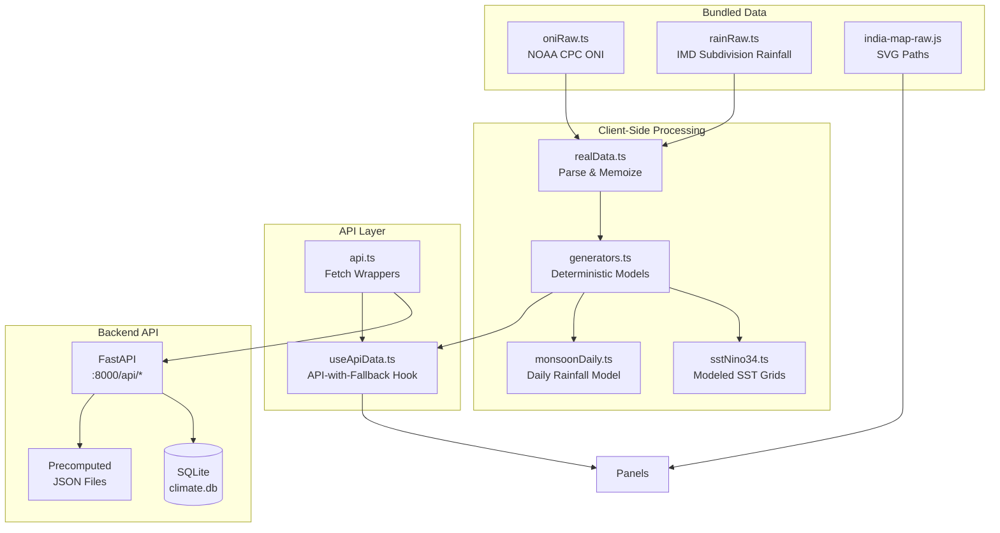

# Dashboard Implementation — ENSO × Indian Monsoon (v3)

> **This document describes the _implemented_ dashboard as of July 2026.**
> For the original design proposal see `Project_Proposal.pdf`.

---

## Architecture Overview

| Layer | Technology | Location |
|-------|-----------|----------|
| **Frontend** | React 18 + Vite + Recharts + Tailwind 4 + shadcn/ui | `Frontend/` |
| **Backend** | FastAPI + SQLite + pre-computed JSON | `backend/` |
| **Data Pipeline** | Python scripts (xarray, pandas, scipy, rasterio) | `backend/scripts/` |
| **Data Store** | SQLite DB + pre-computed JSON + raw NetCDF/GeoTIFF | `data/` |

The frontend is a **self-contained SPA** that bundles real observational data (NOAA ONI 1950–present, IMD rainfall 1901–2015) and uses deterministic seeded generators for modeled data (SST grids, NDVI, monsoon onset). It connects to the FastAPI backend via a Vite dev proxy (`/api/*` → `http://127.0.0.1:8000`) and gracefully falls back to client-side generators when the backend is unreachable.

---

## Dataset Sources

| # | Dataset | Source | Format | Resolution | Time Range |
|---|---------|--------|--------|-----------|------------|
| D1 | **ERSST v6** | NOAA | NetCDF (per-month `.nc`) | 2° × 2° grid, monthly | 2024-02 – 2025-09 (318 files) |
| D2 | **OISST v2.1** | NOAA | NetCDF (`.nc`) | 0.25° × 0.25° grid, daily | Subset (1 file) |
| D3 | **CHIRPS Rainfall** | CHG / UCSB | GeoTIFF (`.tif`) | 5 km, monthly | India extent |
| D4 | **MODIS NDVI** | NASA Terra | GeoTIFF (`.tif`) | 48-day composite, 1 km | 2000–2024 (1 file) |
| D5 | **India States** | — | GeoJSON | State boundaries | — |

### Frontend-Bundled Data

| File | Contents |
|------|----------|
| `src/app/data/oniRaw.ts` | NOAA CPC ONI ASCII (1950–present, all 3-month seasons) |
| `src/app/data/rainRaw.ts` | IMD homogeneous subdivision monthly rainfall (1901–2015) |
| `src/app/data/india-map-raw.js` | SVG path data for India state boundaries |

---

## The 7 Dashboard Panels

The dashboard uses a **12-column CSS grid** layout with 3 rows, optimized for landscape (widescreen) single-viewport display. All panels are wrapped in `<PanelCard>` with a title, info tooltip, and optional header actions.

### Panel G1 — SST Dataset Comparison

| Attribute | Implementation |
|-----------|---------------|
| **Component** | `SstComparePanel.tsx` |
| **Position** | Row 2, columns 1–3 (left) |
| **Type** | Grid heatmap (`GridHeatmap`) of SST anomaly |
| **Data** | `sstNino34.ts` (client-side modeled Niño-3.4 grids) with API fallback to `/api/sst/grid` |
| **Interactivity** | Event dropdown (Nov 2015 / Nov 2020 / Nov 2023); hover tooltip shows lat, lon, SST, anomaly |
| **Compare mode** | Shows two stacked grids: Year A vs Year B |
| **Color scale** | Diverging RdBu, ±3°C domain |

### Panel G2 — Oceanic Niño Index (ONI) Timeline

| Attribute | Implementation |
|-----------|---------------|
| **Component** | `OniStripPanel.tsx` |
| **Position** | Row 1, columns 1–9 (top strip) |
| **Type** | Recharts `AreaChart` with diverging gradient fill + `Brush` selector |
| **Data** | Real NOAA CPC ONI via `getOniSeries()` with API fallback to `/api/oni/timeseries` |
| **Interactivity** | Brush handles set `brushRange` in `FilterContext`, which drives the Phase Distribution and Seasonal Intensity panels |
| **Reference lines** | ±0.5°C El Niño/La Niña thresholds + zero baseline |

> **Note:** The original plan described a slide-out detail drawer. In the implementation, the drawer contents were promoted to standalone right-column panels (Phase Distribution + Seasonal Intensity).

### Panel G3 — Animated Monsoon Onset & Accumulation (HERO)

| Attribute | Implementation |
|-----------|---------------|
| **Component** | `MonsoonHeroPanel.tsx` (via `CenterPanel.tsx` dropdown) |
| **Position** | Row 2–3, columns 4–9 (center, 2-row span) |
| **Type** | Animated India choropleth (`IndiaChoropleth` + `RainfallAnimatedMap`) |
| **Data** | `monsoonDaily.ts` — per-state daily rainfall with cumulative tracking |
| **Encoding** | Fill color = cumulative rainfall (sequential yellow→teal→blue); Dot-overlay pattern density = current-period rainfall intensity |
| **Controls** | `PlaybackControls` — ▶ Play / ⏸ Pause, `Slider` scrubber, speed selector (0.5×/1×/2×/4×) |
| **Sub-chart** | `SeasonCumulativeChart` — multi-line cumulative rainfall for the selected state with a `ReferenceLine` synced to the playback frame |
| **Compare mode** | Side-by-side dual maps (Year A / Year B) with synced animation; cumulative chart overlays both years |
| **Frame label** | Badge showing current date range (e.g., "Jun 15 – Jun 30") |

### Panel G4 — Seasonal Rainfall Anomaly

| Attribute | Implementation |
|-----------|---------------|
| **Component** | `RainfallAnomalyPanel.tsx` (via `CenterPanel.tsx` dropdown) |
| **Position** | Shares center slot with G3 (dropdown toggle) |
| **Type** | Static India choropleth |
| **Data** | `getRainfallAnomalyDetail()` with API fallback to `/api/rainfall/anomaly` |
| **Color scale** | Diverging brown (deficit) ↔ white (normal) ↔ green (surplus) |
| **Tooltip** | State name, actual mm, LPA mm, % deviation |
| **Compare mode** | Side-by-side dual choropleths (Year A / Year B) |

### Panel G5 — ONI vs Rainfall Statistics

| Attribute | Implementation |
|-----------|---------------|
| **Component** | `OniRainfallStatsPanel.tsx` |
| **Position** | Row 3, columns 1–3 (bottom-left) |
| **Type** | Tab toggle between **Scatter** and **Sensitivity** views |
| **Scatter** | `OniRainfallScatter` — per-state per-year ONI vs rainfall anomaly %; OLS regression line; Pearson r + p-value; dots colored by ENSO phase |
| **Heatmap** | `StateSensitivityHeatmap` — single-column ranked list of states by Pearson r (diverging color); clicking a state switches to Scatter view |
| **Data** | `getStateOniCorrelation()` / `getStateOniScatter()` with API fallback to `/api/correlation/heatmap` and `/api/correlation/scatter` |

### Phase Distribution Panel

| Attribute | Implementation |
|-----------|---------------|
| **Component** | `PhaseDistributionPanel.tsx` |
| **Position** | Right column (row 1–2, columns 10–12), top sub-cell |
| **Type** | Recharts `PieChart` donut via `PhaseDonut` |
| **Data** | `getPhaseDistribution(brushRange)` — counts of El Niño / La Niña / Neutral months |
| **Behavior** | Reacts to G2 brush range |

### Seasonal Intensity Panel

| Attribute | Implementation |
|-----------|---------------|
| **Component** | `SeasonalIntensityPanel.tsx` |
| **Position** | Right column (row 1–2, columns 10–12), bottom sub-cell |
| **Type** | `OniSeasonalMatrix` — `GridHeatmap` of month × year ONI values |
| **Data** | `getOniMonthYearMatrix(brushRange)` |
| **Color scale** | Diverging, ±2.5 domain (La Niña ↔ neutral ↔ El Niño) |
| **Behavior** | Reacts to G2 brush range |

### Panel G6 — NDVI vs ONI (Vegetation Impact)

| Attribute | Implementation |
|-----------|---------------|
| **Component** | `NdviOniPanel.tsx` |
| **Position** | Row 3, columns 10–12 (bottom-right) |
| **Type** | Recharts dual-axis `ComposedChart` |
| **Data** | `getNdviOniSeries()` with API fallback to `/api/ndvi/regional` |
| **Left axis** | NDVI (green `Line`, domain 0.2–0.8) |
| **Right axis** | ONI (shaded `Area` with red→blue gradient, domain ±2.5) |
| **Kharif highlight** | `ReferenceArea` shading over weeks 4–15 |
| **Region selector** | `ViewSelect` dropdown (North / South / East & NE / West / Central) |
| **Compare mode** | Overlays Year B NDVI as dashed line |

---

## Layout (CSS Grid)

```
┌────────────────────────────────────────────────────────────────────────────────┐
│ DashboardHeader: [Logo] Year A [▼] Year B [▼] Phase [▼] State [▼] | Reset | ⚡Compare | 🌙 │
├─────────────────────────────────────────────────┬──────────────────────────────┤
│ G2: ONI Strip (cols 1-9, row 1)                  │ Phase Donut (cols 10-12)    │
│ ▓▓▓▓░░░░▓▓▓▓▓░░░░▓▓▓▓░░░░░▓▓▓▓▓░░░░░▓▓▓▓▓▓▓   │                            │
│ [=====brush=====]                                │ Seasonal Intensity          │
├──────────┬──────────────────────────┬────────────┤ (month × year heatmap)     │
│ G1: SST  │ G3/G4: Center Panel     │            ├──────────────────────────────┤
│ Compare  │ (dropdown: Monsoon      │            │                              │
│ Panel    │  onset / Rainfall       │            │                              │
│          │  anomaly)               │            │                              │
│          │                         │            │                              │
│          │  [India Map / Anomaly]  │            │                              │
│          │  [Cumulative Chart]     │            │                              │
│          │  [▶ Playback Controls]  │            │                              │
├──────────┼──────────────────────────┼────────────┴──────────────────────────────┤
│ G5: ONI  │                         │ G6: NDVI vs ONI                           │
│ vs Rain  │     (center spans       │ (dual-axis: NDVI + ONI)                   │
│ Stats    │      both rows)         │                                           │
│ [Scatter │                         │ ──── NDVI  ▓▓▓▓ ONI                      │
│ /Heatmap]│                         │ [Region ▼]                                │
└──────────┴─────────────────────────┴──────────────────────────────────────────┘
```

### Grid Specification

```css
grid-cols-12
lg:grid-rows-[0.8fr_2.3fr_1.5fr]
```

| Panel | Column Span | Row Span |
|-------|------------|----------|
| G2 ONI Strip | col 1–9 | row 1 |
| Phase Distribution | col 10–12 | row 1–2 (top sub-cell) |
| Seasonal Intensity | col 10–12 | row 1–2 (bottom sub-cell) |
| G1 SST | col 1–3 | row 2 |
| G3/G4 Center | col 4–9 | row 2–3 |
| G5 Stats | col 1–3 | row 3 |
| G6 NDVI | col 10–12 | row 3 |

---

## Compare Mode

Toggling **⚡ Compare** in the header enables global Year A vs Year B comparison:

| Panel | Compare Behavior |
|-------|-----------------|
| **G1 SST** | Two stacked grids (Year A top, Year B bottom) |
| **G3 Monsoon** | Side-by-side dual India maps with synced animation |
| **G4 Anomaly** | Side-by-side dual choropleths |
| **G5 Stats** | Ringed dots highlight Year A / Year B in scatter |
| **G6 NDVI** | Year B NDVI overlaid as dashed line |
| **Header** | Year B selector becomes visible |

---

## Cross-Filter State (`FilterContext`)

```typescript
interface FilterState {
  year: number;              // Year A (default: 2015)
  compareYear: number;       // Year B (default: 1988)
  phase: Phase | "All";
  state: string | "All";
  subdivision: string | "All";
  selectedRegionId: string | null;   // map click
  hoveredRegionId: string | null;
  brushRange: [number, number] | null;  // ONI series indices
  playbackDay: number;                  // G3 animation frame (0..152)
  isPlaying: boolean;
  compareMode: boolean;                 // global Year A vs Year B mode
}
```

All panels consume this context via `useFilters()` and react to changes automatically.

---

## Frontend Data Flow



**Key design:** The `useApiData` hook tries the backend API first. If it returns data, that data replaces the client-side version. If the API fails (404, network error), the client-side generators provide identical data shapes. This makes the frontend fully functional without the backend.

---

## Component Tree

```
App.tsx
├── ThemeProvider (next-themes)
├── FilterProvider (FilterContext)
├── TooltipProvider (shadcn)
├── DashboardHeader
│   ├── YearSelect × 1-2
│   ├── Phase Select
│   ├── State Select
│   ├── Reset Button
│   └── ⚡ Compare Switch
└── Grid Layout
    ├── OniStripPanel (G2)
    │   └── AreaChart + Brush
    ├── SstComparePanel (G1)
    │   └── GridHeatmap × 1-2
    ├── CenterPanel (dropdown toggle)
    │   ├── MonsoonHeroPanel (G3)
    │   │   ├── RainfallAnimatedMap × 1-2
    │   │   ├── SeasonCumulativeChart
    │   │   └── PlaybackControls
    │   └── RainfallAnomalyPanel (G4)
    │       └── IndiaChoropleth × 1-2
    ├── Right Column
    │   ├── PhaseDistributionPanel
    │   │   └── PhaseDonut
    │   └── SeasonalIntensityPanel
    │       └── OniSeasonalMatrix
    ├── OniRainfallStatsPanel (G5)
    │   ├── OniRainfallScatter
    │   └── StateSensitivityHeatmap
    └── NdviOniPanel (G6)
        └── ComposedChart (dual-axis)
```

---

## Unused / Legacy Components

The following components exist from earlier iterations but are **not rendered** by the current `App.tsx`:

| Directory | Files | Status |
|-----------|-------|--------|
| `components/modules/` | `OverviewModule`, `OniTimelineModule`, `SpatialCompareModule`, `MonsoonProgressModule`, `StatsModule`, `AgricultureModule` | Superseded by `graphs/` panels |
| `components/single/` | `HeroMapPanel`, `TimelinePanel`, `OceanYearsPanel`, `RelationshipsPanel`, `VegetationPanel` | Superseded by `graphs/` panels |
| `components/` | `GlobalFilterSidebar`, `GlobalFilterBar` | Superseded by `DashboardHeader` |

These may be safely removed in a future cleanup pass.
