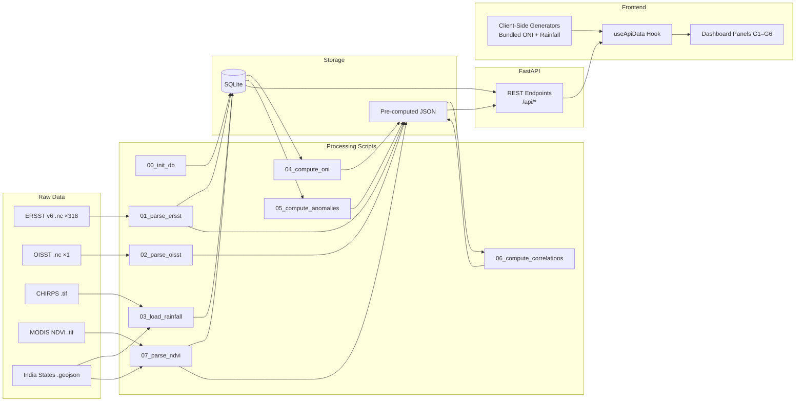

# Dataset & Backend Architecture

> **This document describes the _implemented_ data pipeline and backend as of July 2026.**

---

## 1. Raw Dataset Inventory

| # | Dataset | Source | Format | Resolution | Files |
|---|---------|--------|--------|-----------|-------|
| D1 | **ERSST v6** | NOAA NCEI | NetCDF (per-month `.nc`) | 2° × 2° grid, monthly | 318 files (`ersst.v6.YYYYMM.nc`) |
| D2 | **OISST v2.1** | NOAA NCEI | NetCDF (`.nc`) | 0.25° × 0.25° grid, daily | 1 file (subset) |
| D3 | **CHIRPS India Rainfall** | CHG / UCSB | GeoTIFF (`.tif`) | 5 km, monthly | 1 multi-band file |
| D4 | **MODIS NDVI** | NASA Terra (MOD13A2) | GeoTIFF (`.tif`) | 1 km, 48-day composite | 1 multi-band file |
| D5 | **India State Boundaries** | — | GeoJSON | State-level | 1 file |

### Download Sources

| Dataset | URL |
|---------|-----|
| ERSST v6 | https://www.ncei.noaa.gov/products/extended-reconstructed-sst |
| OISST v2.1 | https://www.ncei.noaa.gov/products/optimum-interpolation-sst |
| CHIRPS | https://www.chc.ucsb.edu/data/chirps |
| MODIS NDVI | https://lpdaac.usgs.gov/products/mod13a2v061/ |

---

## 2. Directory Structure

```
project-root/
│
├── data/                                ← Shared data directory
│   ├── raw/                             ← IMMUTABLE originals
│   │   ├── ersst/
│   │   │   ├── ersst.v6.202402.nc
│   │   │   ├── ersst.v6.202403.nc
│   │   │   └── ... (318 monthly files)
│   │   ├── oisst/
│   │   │   └── (OISST subset .nc)
│   │   ├── rainfall/
│   │   │   ├── CHIRPS_India_Monthly_Rainfall_5km.tif
│   │   │   └── india_states.geojson
│   │   └── ndvi/
│   │       └── MOD13A2_India_NDVI_48day_2000_2024.tif
│   │
│   ├── db/
│   │   └── climate.db                   ← SQLite database (~1.5 MB)
│   │
│   ├── precomputed/                     ← JSON files for fast API serving
│   │   ├── oni/
│   │   │   ├── oni_timeseries.json
│   │   │   └── phase_summary.json
│   │   ├── sst/
│   │   │   ├── ersst/
│   │   │   │   ├── nov_2015.json
│   │   │   │   ├── nov_2020.json
│   │   │   │   └── nov_2023.json
│   │   │   └── oisst/
│   │   │       ├── nov_2015.json
│   │   │       ├── nov_2020.json
│   │   │       └── nov_2023.json
│   │   ├── rainfall/
│   │   │   ├── anomaly/
│   │   │   │   ├── 2009.json ... 2024.json  (16 files)
│   │   │   └── cumulative/
│   │   │       ├── {State}_{year}.json      (~570 files)
│   │   │       └── ...
│   │   ├── correlation/
│   │   │   └── heatmap.json
│   │   └── ndvi/
│   │       ├── national_kharif.json
│   │       └── regional/
│   │           ├── north.json
│   │           ├── south.json
│   │           ├── east.json
│   │           ├── west.json
│   │           └── central.json
│   │
│   ├── .cache/                          ← Processing cache
│   └── .gitattributes                   ← LFS tracking
│
├── backend/                             ← FastAPI project (uv-managed)
│   ├── pyproject.toml                   ← Dependencies
│   ├── uv.lock
│   ├── .python-version                  ← 3.12+
│   ├── backend/                         ← Python package
│   │   ├── main.py                      ← FastAPI app
│   │   ├── config.py                    ← Paths (DATA_DIR → project-root/data/)
│   │   ├── database.py                  ← SQLite connection factory
│   │   └── routers/
│   │       ├── __init__.py
│   │       ├── sst.py
│   │       ├── oni.py
│   │       ├── rainfall.py
│   │       ├── correlation.py
│   │       └── ndvi.py
│   ├── scripts/                         ← One-time processing pipeline
│   │   ├── 00_init_db.py
│   │   ├── 01_parse_ersst.py
│   │   ├── 02_parse_oisst.py
│   │   ├── 03_load_rainfall.py
│   │   ├── 04_compute_oni.py
│   │   ├── 05_compute_rainfall_anomalies.py
│   │   ├── 06_compute_correlations.py
│   │   └── 07_parse_ndvi.py
│   └── tests/
│       ├── test_sst.py
│       ├── test_oni.py
│       ├── test_rainfall.py
│       ├── test_correlation.py
│       └── test_ndvi.py
│
└── Frontend/                            ← React + Vite SPA
    ├── package.json
    ├── vite.config.ts                   ← Includes /api proxy
    ├── src/
    │   ├── main.tsx
    │   ├── styles/
    │   └── app/
    │       ├── App.tsx
    │       ├── context/FilterContext.tsx
    │       ├── data/                    ← Data layer
    │       │   ├── api.ts              ← Backend fetch wrappers
    │       │   ├── useApiData.ts       ← API-with-fallback hook
    │       │   ├── generators.ts       ← Client-side data generators
    │       │   ├── realData.ts         ← Parse bundled ONI/rainfall
    │       │   ├── sstNino34.ts        ← Modeled SST grids
    │       │   ├── monsoonDaily.ts     ← Daily rainfall model
    │       │   ├── oniRaw.ts           ← Bundled NOAA ONI data
    │       │   ├── rainRaw.ts          ← Bundled IMD rainfall data
    │       │   └── ...
    │       ├── components/
    │       │   ├── graphs/             ← G1–G6 panel components
    │       │   ├── monsoon/            ← Animated map sub-components
    │       │   ├── oni/                ← ONI detail sub-components
    │       │   ├── stats/              ← Correlation sub-components
    │       │   ├── maps/               ← IndiaChoropleth
    │       │   ├── heatmap/            ← GridHeatmap
    │       │   ├── single/             ← PanelCard, ChartBox, ViewSelect
    │       │   └── ui/                 ← 48 shadcn/ui components
    │       └── lib/colorScale.ts
    └── ...
```

---

## 3. SQLite Schema

### Table: `daily_rainfall`

Stores monthly rainfall data (on the 1st of each month). Supports cumulative calculations, date-range filters, and state drill-downs.

```sql
CREATE TABLE daily_rainfall (
    id          INTEGER PRIMARY KEY AUTOINCREMENT,
    state       TEXT    NOT NULL,
    date        DATE    NOT NULL,
    rainfall_mm REAL    NOT NULL,
    UNIQUE(state, date)
);
CREATE INDEX idx_rainfall_state_date ON daily_rainfall(state, date);
CREATE INDEX idx_rainfall_date ON daily_rainfall(date);
```

### Table: `oni_monthly`

Pre-computed ONI derivation per month. Stores intermediate values for the derivation proof visualization.

```sql
CREATE TABLE oni_monthly (
    year_month      TEXT    PRIMARY KEY,  -- "2015-06"
    sst_raw         REAL    NOT NULL,
    climatology     REAL    NOT NULL,
    anomaly         REAL    NOT NULL,
    oni             REAL    NOT NULL,
    phase           TEXT    NOT NULL      -- "El Nino" / "La Nina" / "Neutral"
);
CREATE INDEX idx_oni_phase ON oni_monthly(phase);
```

### Table: `ndvi_regional`

Pre-aggregated NDVI by region (North/South/East/West/Central).

```sql
CREATE TABLE ndvi_regional (
    region          TEXT    NOT NULL,
    composite_start DATE    NOT NULL,
    composite_end   DATE    NOT NULL,
    mean_ndvi       REAL    NOT NULL,
    ndvi_anomaly    REAL,
    PRIMARY KEY (region, composite_start)
);
CREATE INDEX idx_ndvi_region ON ndvi_regional(region);
```

### Table: `rainfall_lpa`

Long Period Averages per state per month — the baseline for anomaly calculations.

```sql
CREATE TABLE rainfall_lpa (
    state       TEXT    NOT NULL,
    month       INTEGER NOT NULL,
    lpa_mm      REAL    NOT NULL,
    PRIMARY KEY (state, month)
);
```

---

## 4. Processing Pipeline Scripts

Run in order from `backend/`. Each script reads from `data/raw/`, writes to `data/db/` and/or `data/precomputed/`.

```bash
cd backend
uv run python scripts/00_init_db.py
uv run python scripts/01_parse_ersst.py
uv run python scripts/02_parse_oisst.py
uv run python scripts/03_load_rainfall.py
uv run python scripts/04_compute_oni.py
uv run python scripts/05_compute_rainfall_anomalies.py
uv run python scripts/06_compute_correlations.py
uv run python scripts/07_parse_ndvi.py
```

| Script | Input | Output | Description |
|--------|-------|--------|-------------|
| `00_init_db.py` | — | `climate.db` (empty tables) | Creates all 4 tables with indexes |
| `01_parse_ersst.py` | `raw/ersst/*.nc` | `precomputed/sst/ersst/*.json` + `oni_monthly` table | Opens multi-file ERSST v6 dataset, crops to Niño 3.4, extracts event grids, computes area-weighted SST → ONI with 3-month centered rolling mean, classifies phases |
| `02_parse_oisst.py` | `raw/oisst/*.nc` | `precomputed/sst/oisst/*.json` | OISST high-res grids for visual comparison (G1) |
| `03_load_rainfall.py` | `raw/rainfall/CHIRPS*.tif` + `india_states.geojson` | `daily_rainfall` + `rainfall_lpa` tables | Zonal stats of CHIRPS raster per state per month; computes LPA |
| `04_compute_oni.py` | `oni_monthly` table | `precomputed/oni/*.json` | Exports ONI timeseries and phase summary JSONs |
| `05_compute_rainfall_anomalies.py` | `daily_rainfall` + `rainfall_lpa` | `precomputed/rainfall/anomaly/*.json` + `cumulative/*.json` | Per-year anomaly maps, per-state cumulative rainfall curves |
| `06_compute_correlations.py` | `precomputed/rainfall/anomaly/*.json` + `oni_timeseries.json` | `precomputed/correlation/heatmap.json` | Pearson r between JJAS ONI and each state's rainfall anomaly |
| `07_parse_ndvi.py` | `raw/ndvi/MOD13A2*.tif` | `ndvi_regional` table + `precomputed/ndvi/*.json` | Zonal NDVI by region, joined with ONI, filtered to Kharif |

---

## 5. FastAPI Backend

### Setup & Run

```bash
cd backend
uv sync                                    # Install dependencies
uv run python scripts/00_init_db.py        # Initialize DB (first time)
uv run uvicorn backend.main:app --reload   # Start on :8000
```

### `backend/config.py` — Path Resolution

```python
BASE_DIR = Path(__file__).resolve().parent.parent   # → backend/
PROJECT_ROOT = BASE_DIR.parent                      # → project root
DATA_DIR = PROJECT_ROOT / "data"                    # → project-root/data/
```

### API Endpoints

#### SST Router (`/api/sst`)

| Method | Endpoint | Params | Source | Used By |
|--------|----------|--------|--------|---------|
| GET | `/api/sst/grid` | `dataset` (ersst/oisst), `event` (nov_2015/nov_2020/nov_2023) | JSON file | G1 |

#### ONI Router (`/api/oni`)

| Method | Endpoint | Params | Source | Used By |
|--------|----------|--------|--------|---------|
| GET | `/api/oni/timeseries` | — | JSON file | G2 |
| GET | `/api/oni/details` | `start`, `end` (year-month) | SQLite query | ONI detail |
| GET | `/api/oni/phase-summary` | `start`, `end` | SQLite query | Phase donut |

#### Rainfall Router (`/api/rainfall`)

| Method | Endpoint | Params | Source | Used By |
|--------|----------|--------|--------|---------|
| GET | `/api/rainfall/anomaly` | `year` | JSON file | G4 |
| GET | `/api/rainfall/cumulative` | `state`, `year` | JSON file | G3 |
| GET | `/api/rainfall/animation-frame` | `year`, `start_date`, `end_date` | SQLite query | G3 |

#### Correlation Router (`/api/correlation`)

| Method | Endpoint | Params | Source | Used By |
|--------|----------|--------|--------|---------|
| GET | `/api/correlation/heatmap` | — | JSON file | G5 |
| GET | `/api/correlation/scatter` | `state` | JSON file | G5 |

#### NDVI Router (`/api/ndvi`)

| Method | Endpoint | Params | Source | Used By |
|--------|----------|--------|--------|---------|
| GET | `/api/ndvi/regional` | `region` | JSON file | G6 |
| GET | `/api/ndvi/national` | — | JSON file | G6 |

---

## 6. Python Dependencies

Managed via `pyproject.toml` with `uv`:

```toml
[project]
requires-python = ">=3.12"
dependencies = [
    "fastapi>=0.139.0",
    "uvicorn>=0.51.0",
    "xarray>=2026.7.0",
    "netcdf4>=1.7.4",
    "pandas>=3.0.3",
    "numpy>=2.5.1",
    "scipy>=1.18.0",
    "geopandas>=1.1.4",
    "rasterio>=1.5.0",
    "rasterstats>=0.21.0",
    "dask>=2026.7.0",
    "matplotlib>=3.11.0",
    "httpx>=0.28.1",
    "pytest>=9.1.1",
]
```

---

## 7. Frontend ↔ Backend Integration

The frontend connects to the backend via a **Vite dev proxy**:

```typescript
// vite.config.ts
server: {
  proxy: {
    '/api': {
      target: 'http://127.0.0.1:8000',
      changeOrigin: true,
    },
  },
},
```

Each panel uses the `useApiData` hook:

```typescript
const { data, source } = useApiData({
  apiFn: () => fetchOniTimeseries(),   // Try backend
  transform: (api) => /* ... */,        // Shape API response
  fallback: () => getOniSeries(),       // Client-side generator
  deps: [],
});
// source === "api" when backend responded, "local" on fallback
```

---

## 8. Data Flow Summary


